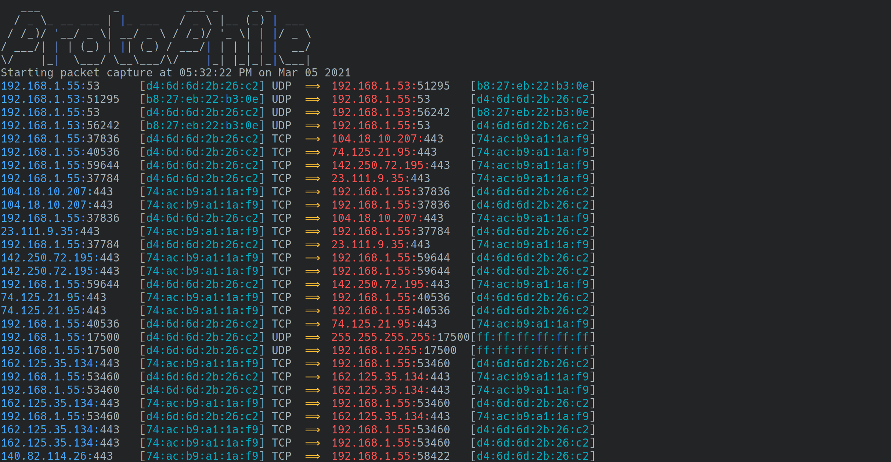

## Description
ProtoPhile is a protocol analyzer focused on descriptive power and legibility. It allows for the collection of all network traffic to and from the host it's running on.

# Example Output

